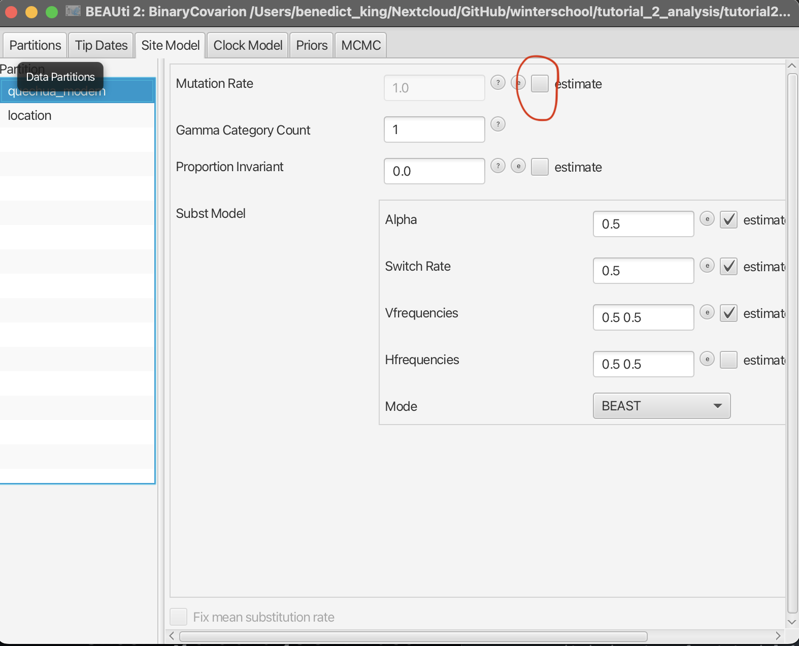
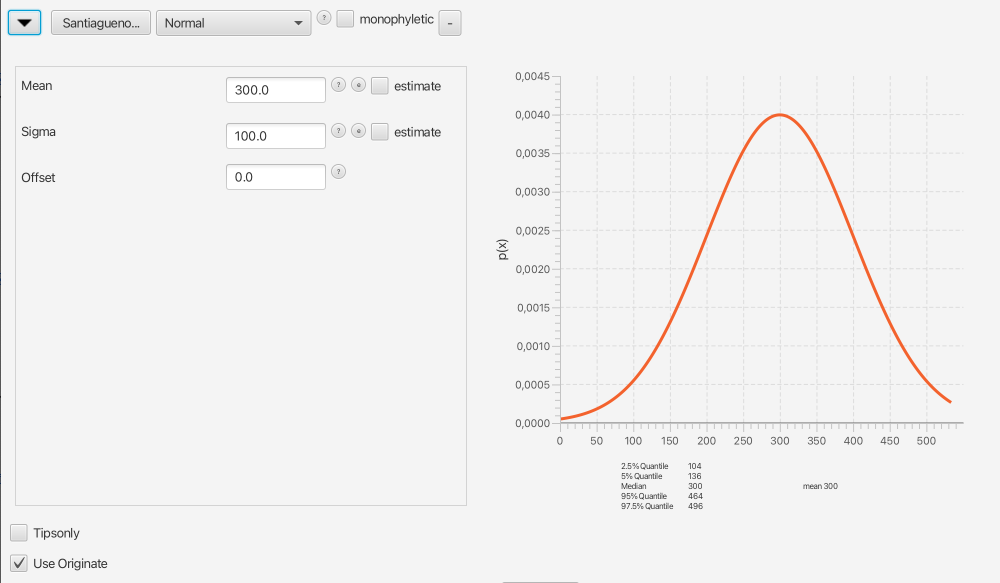
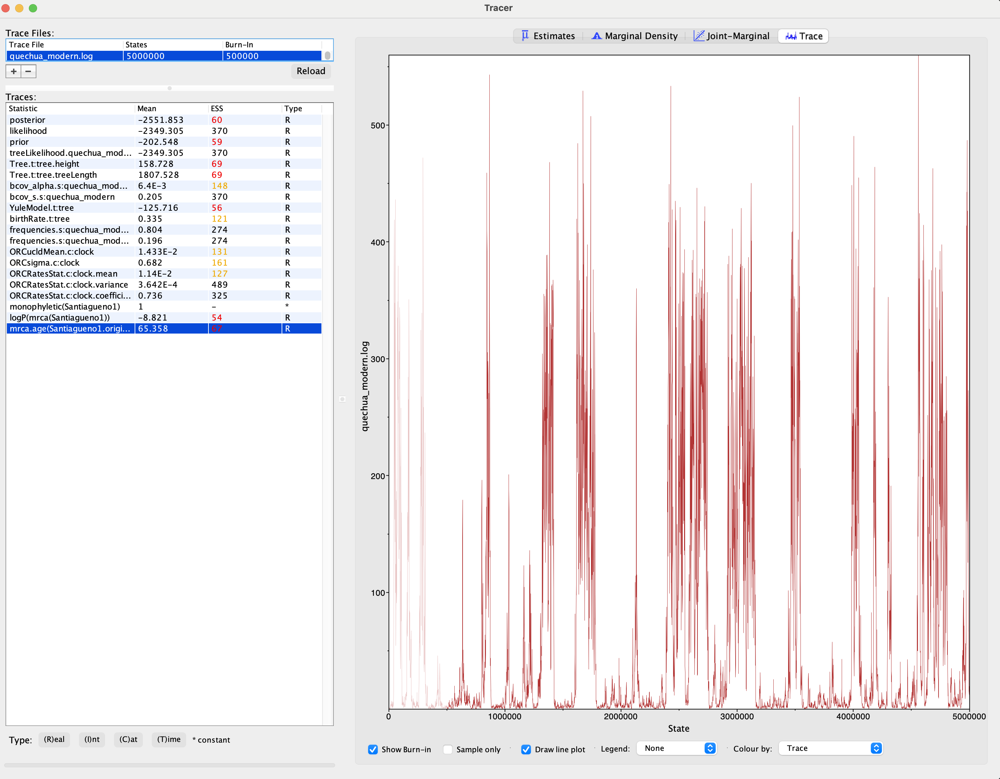
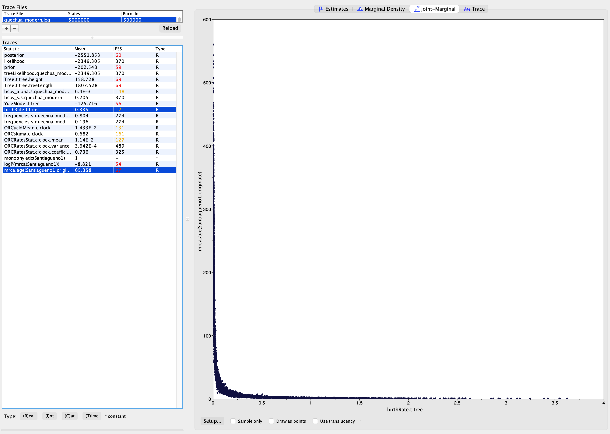

# Building Bayesian Language Phylogenies with BEAST2

*Author:* Benedict King  

## Table of Contents
1. [Introduction](#introduction)
2. [Software used in this tutorial](#software-used-in-this-tutorial)
3. [Installing packages](#installing-packages)
4. [Choose the correct template](#choose-the-correct-template)
5. [Load the data](#load-the-data)
6. [The site model tab](#the-site-model-tab)
7. [The clock model tab](#the-clock-model-tab)
8. [The priors tab](#the-priors-tab)
9. [Calibrating the tree](#calibrating-the-tree)
10. [The MCMC tab](#the-mcmc-tab)
11. [Checking the progress of the analysis](#checking-the-progress-of-the-analysis)
12. [Summary statistics](#summary-statistics)
13. [Summary trees](#summary-trees)
14. [Relaxed Clock](#relaxed-clock)
15. [Alternative calibrations](#alternative-calibrations)

---

## Introduction
In this tutorial we will build a phylogeny of the Quechuan language family. We start with an alignment of cognate sets in **nexus** (.nex) format. This is the file quechua_modern.nex. From this we build an XML file with all our analysis settings, which can be run in BEAST. 

---

## Software used in this tutorial
### [BEAST2](https://www.beast2.org/)
This is the main software for performong the Bayesian analysis via MCMC. It takes as input a file in XML format. The XML file contains code to provide BEAST2 with the data, details of the models and parameters used, the operators for the MCMC, and it also tells BEAST what to save to the output files. 

### BEAUti
This program comes packaged with BEAST2. BEAUti is a graphical user interface program which produces XML files, which can then be loaded into BEAST2 for analysis. 

### [Tracer](https://github.com/beast-dev/tracer/releases/tag/v1.7.2)
Tracer is a program for checking the output of BEAST2 analyses. It is used to summarise parameters values, and also to check if the analysis has run long enough.

### Tree Annotator
Another program that comes packaged with BEAST2. The output of a BEAST2 analysis is a sample of trees. TreeAnnotator takes this sample of trees and calculates a single summary tree. The branches of the annotated tree are labelled with key statistics, such as the support for that branch or the rate of evolution.

### [FigTree](https://github.com/rambaut/figtree/releases/tag/v1.4.4) (optional)
FigTree is used to display the summary trees from Tree Annotator. There are a number of functions to choose the font of the language names, which statistics to show as branch labels, coloring the branches according to the rate of evolution, etc. Figtree is often used to make the figures that appear in publications.

---

## Installing packages
BEAST2 has a large number of add-on packages for performing various specialised types of analysis. The package Babel is for analysis of language data. It needs to be installed as an add-on.

To install Babel through BEAUti, first add the extra repositories to the package manager like so:
- start BEAUti, 
- choose File/Manage packages
- click ‘Package repositories’
- Add URL https://raw.githubusercontent.com/CompEvol/CBAN/master/packages-extra.xml, click DONE

Babel now appears in the list of packages
- Select Babel
- Click install

Also install the following packages

- **ORC**, which is a faster and more efficient version of the relaxed clock, the Optimised Relaxed Clock.
- **CCD**, the latest and best form of summary tree

For newly installed packages to take effect you probably need to restart BEAUti. Simply close it and re-open.

---

## Choose the correct template
Some analyses require a specialised template, configure the BEAST2 XML file in the correct way. The template needs to be selected *before* doing anything else. We want to use the binary covarion model of cognate evolution, which requires a template.

- choose File/Template/BinaryCovarion

---

## Load the data

- choose File/Add Alignment
- Navigate to the Nexus file and select it. 

Hopefully your data has now appeared in BEAUti:

Along the top of the BEAUti interface are a number of tabs. At the moment we are in the tab **partitions**, which lists all the sources of data for this analysis. At the moment there is just one, which is why there is a single line.

The next tab is **tip dates**. This is only for when the languages come from different time points (e.g. ancient languages). We can ignore this tab because we are not using tip dates.

---

## The site model tab

Let's look at the next tab, the **site model** tab. This is where we control all the parameters of the cognate evolution model. In this case, because we already selected the **Binary Covarion** template, the relevant parameters for this model already appear in ths tab. The first few entries in this tab are **mutation rate**, **Gamma category count** and **Proportion Invariant**. These three parameters are **site model** paramters, which describe how different cognate sets might evolve differently from each other. For now we are making the simplifying assumption that all of the cognate sets evolve under the same model, so we can ignore these parameters. Below this is the **subst model** section (**substitution model**), which in our case is the binary covarion.

Recall from the lecture that with the binary covarion model we have two states, absent and present, each of which are further diveed into two rate categories. We have an absent-slow and an absent-fast state, as well as present-slow and present-fast. These fast and slow states are also called the on and off states.

Here is the diagram of the binary covarion model from the lecture again. Can you work out which parameters in the BEAUti model belong where on the diagram?

For now we can leave all the parameters on their default values. Notice the **estimate** check boxes. As the name suggests, ticking this box means that the parameter value is estimated as part of the analysis. If it is unchecked, then the parameter value remains fixed throughout the analysis. When a parameter is estimated it requires an operator so that new values for the parameter are proposed during the MCMC. 

Due to a bug in BEAST2, The Mutation Rate parameter might be an estimated parameter i.e. it has an operator and it's value can change. However, it is not possible to simultaneously estimate this and the clock rate, and leaving mutation rate as an esimated will lead to issues with convergence. In the Site Model tab, click on the lexical partition (quechua modern), and untick the estimate box next to Mutation Rate. Make sure this box is not ticked.

> ### Optional: understanding esimated parameters and operators
>To gain a better understanding of Operators, it helps to take a look. To see the list of operators, select View > Show Operators Panel. Now click on the Operators tab and you will see a list of operators. Find the operator for the covarion alpha (hint, it's probably the first one). Go back to the site model tab and uncheck the estimate box for the **alpha** parameter. Go back to the Operators panel. You should find that the operator for the alpha has now disappeared. 

---

## The clock model tab

Start by analysing the data using a **Strict Clock**, the simplest model which assumes all branches have the same rate. You will notice that there is box for the **Clock rate**, which is by default set at 1.0. The clock rate determines the average rate of evolution (number of cognate changed per year). Next to this is the box marked **estimate**, but it is greyed out and cannot be ticked. This is because we need the tree to be **calibrated** before we can estimate the clock rate.

---

## The Priors tab

In this tab we can select the tree model, and also choose prior probability distributions for the model parameters.

There is a drop-down menu for choosing the tree model. The default is **Yule Model**, which has only a birth rate parameter.

The remaining options are for choosing the prior probability distributions for the model parameters. Clock on the arrows on the left to expand the options for each prior. There is also a useful preview of the prior probability distribution.

Let's try to change some of these priors to something different from the default values.

#### Changing priors

*   Set the covarion alpha prior to a Uniform with a lower bound of 0 and an upper bound of 5.0
*   Set the birth rate prior to an exponential distribution with a mean of 0.5
*   Set the clock rate prior to a Uniform distribution with a lower bound of 0 and an upper bound of 2.0

---

## Calibrating the tree

If we want to add a node calibration to the phylogeny, we add what is called an Most Recent Common Ancestor (MRCA) prior. This type of prior places an prior age distribution on the MRCA of a set of languages. The MRCA is the node in the tree which is directly ancestral to a given set of languages. 

First we need to select a set of languages to define which node in the tree we want to add the prior to. Then we need to decide on a suitable age distribution.

* Click on **Add Prior**
* Select MRCA prior from the drop-down menu

You now have two columns of languages, the right column is the languages that define the MRCA for the calibration. It is currently empty. 

* Select all the languages in the left column and click >> to move them into the right column. The MRCA of all the languages is the root of the tree
* We need to give our set of languages a name in Taxon Set Label. let's call it **root**.
* Click OK and you will see this appear as a new prior in the list
* Select a normal prior with mean 2000 and standard deviation (Sigma) of 200.

---

## The MCMC tab

This tab contains some options for running the analysis. One of the options is **Chain Length**. Set this to 2 Million. 

We are now ready to export the BEAST2 XML file and run the analysis. Click File > Save and choose a suitable file name and location to save the XML file (something like quechuan.xml will do). We will be running multiple analyses today, so it is a good idea to put each analysis in a separate folder with a sensible name.

---

# Running the analysis

Now open the **BEAST2** program itself. A dialog box like the following will appear.

Click on *Choose File* and select the xml file you just exported from Beauti. The click **Run** and that's it, the analysis is already running!

You will see a window with some number appearing row by row. This is the **screen log**, which prints out some numbers from each sampled generation of the MCMC as it runs. This is usually the generation number, the posterior, likelihood and prior. It also tells you the time taken per million generations. Given that we are running the analysis for 10 million generations, how long will it take?

If you navigate to the folder where the xml file is, you will see some other files have also appeared. One of these is the **parameter log file** (something like crossandean-quechuan.log). This file stores the parameter values from each step of the MCMC. Another file is the **tree log file** which stores the trees from the same MCMC chain. Finally, there is a **state** file. The state file allows users to restart analysis that have been interupted or need to run for longer.

---

# Checking the progress of the analysis

We don't need to wait for the analysis to finish to take a look at how it is going. OPEN THE **TRACER** app. Load the parameter log file by clicking File > Import Trace File. It's also possible just to drag and drop the trace file into the tracer window to import it. 

On the top left of the window is a list of all the trace log files currently loaded. More than one can be loaded and they can be selected in this box. In the bottom-left pane of the Tracer window is a list of paramaters. The pane on the right allows for various visualisations.

Let's first look at the posterior. Click on the **Trace** tab in the top right. The trace is just a line graph showing the value of the selected parameter in each sampled generation of the MCMC. We want to see *no correlation* between each of the points, so the trace should look a bit like a hairy caterpillar. There should be no trend. Here is the example of the good, bad and very bad traces again.

Another way to tell if the analysis has run long enough is to look at the effective sample size. This is on the left, in the column **ESS**. As a general rule of thumb, ESS values should all be over 200. 

If any of the parameters do not have a high enough ESS, there are a number of steps that can be taken.

### Resuming the analysis

One possibility is just to run the analysis longer. To do this, go back to the BEAST2 app and load the same xml file. In the drop down menu immdiately underneath change from *default: only write new log files* to *resume: appends log to existing files (if any)*. The click run. This option continues the analysis from where it stopped, which is possible because all the details of the last point of the MCMC were stored in the *state file*

### Changing operator settings

A second possibility is to change the options of the analysis. For example, you might find that the frequencies have low ESS values. The ESS can be increased by increasing the *weight* of the operator on this parameter. This means that the analysis spends more time trying new values for the parameter. 

* Go back to BEAUti (if you already closed it, reopen the xml file by clicking on File>Load). 
* Go to the operators panel (View > Show Operators Panel) and look for the operator of interest (Delta Exchange: frequencies...). 
* Click on the arrow to expand the options and chang the weight to something higher, such as 0.5 instead of 0.1. 
* Then save the xml file and run the analysis as before. 
* **DO NOT** resume the analysis, instead choose *overwrite* from the drop-down menu at the top.

## Summary statistics

Once you are satisfied that the analysis has run for long enough, It is possible to make some visualisations of parameter values. A good way to do this is to click on the **Marginal Density** tab. This gives you a visual overview of the full posterior estimates of the selected parameter. In the **Estimates** tab there are some basics such as the mean, standard error and the 95% Highest Posterior Density interval. The 95% HPD is a range within which 95% of the posterior sample lies.

* What is the 95% HPD for the birth rate?

---

# Summary trees

Open the **TreeAnnotator** app which comes with Beast2. 

* The burn in percentage is set to a default of 10. This is probably sufficient, but you should check in Tracer how much burn-in is required
* For Target tree type, select MAP (CCD0). This type of summary tree has been shown to be better than others
* For Node heights, median is often used.
* For input tree file, choose the **tree log file** (filename something like crossandean-quechuan.trees). 
* Choose an appropriate output file name, such as crossandean-quechuan_CCD0.tree
* click run

## Viewing the summary tree

You can open the summary tree by going to the website [IcyTree](https://icytree.org/). Alterntaively, the summary tree can be viewed in FigTree. There are many options available to change the visualisation of the tree, such as colouring the branches or visuallising the range of possible dates for a node on the tree. To do the latter in IcyTree, click Style > node height error bars > height_95%HPD. 

# Further analyses

We have now performed a simple phylogenetic analysis in beast2 and obtained a tree. Now we will try some more advanced analyses.

## Relaxed Clock

The strict clock is usually an unrealistic model for language evolution. The relaxed clock, in which some variation in the rate of language evolution between branches is allowed, is usually more realistic.

Reopen the xml file in BEAUti (if you closed BEAUti, File > Load). In the clock model tab, change strict clock to Optimised relaxed clock. Three parameters appear in the Priors panel: the clock mean, sigma and the individual branch rates. The default priors are probably fine for now. Save a new xml (File > Save As) in a new folder, and run the analysis as before.

* Check for convergence in Tracer. Adjust the operators or run the analysis longer, following the instructions above, if necessary
* The Coefficient of Variation, a statistic calculated during the run, is a good measure of the amount of variation in rate between branches. If this overlaps with 0, then there is evidence for a strict clock. If the coefficient of variation doesn't overlap with 0, it is evidence for a relaxed clock. What about your own analysis, is there evidence for a relaxed clock?
* Make a summary tree for the relaxed clock analysis, are there any major differences with the strict clock analysis?

## Alternative calibrations

So far we have used a Normal distribution centred on 2000BP on the root to time-calibrate the tree. This was just a guess. It would be preferable to have calibrations based on evidence. One possibility is to apply a calibration to Argentine Quechuan (Santiagueño). One hypothesis is that Quechuan speakers migrated to Argentina during the spanish colonial period (DeMarrais in Heggarty and Beresford-Jones 2012). We could therfore place a prior that Santiagueño split from its sister languages during this time. Beast has the option to specify priors on the parent node of the common ancestor, rather than the common ancestor itself. This is equivalent to saying "language X became an independent langauge at this time". This is very useful since we don't necessarily have to know what the sister group to language X actually is. This type of calibration is very useful in linguistic analyses.

* In BEAUti, first delete the root calibration by clicking the (-) button.
* Add a new MRCA prior with Santiagueno as the only taxon, you can name it just Santiagueno
* To begin with, set a normal distribution prior with mean 300, sigma 100
* Make sure you tick "Use Originate". This places the distribution on the parent node of Santiagueno, i.e. the point where it splits from the rest of the tree

---

When you look at the results in Tracer, you will probably see that the results are not good, with very poor ESS values. Take a look at the age of the node we just calibrated mrca.age(Santiagueno1.originate). 

It jumps between a very young age, and an age around 300 BP (which matches the calibration). Why is this? It is informative to have a look at the **joint marginal**, which shows correlation between parameters. Compare mrca.age(Santiagueno1.originate) with the birth rate.

It's possible that the priors on the node age and the brith rate are interacting somehow. This is where we introduce an important conecept in Bayesian statistics: **sampling from the prior**. Sampling from the prior means running the analysis with no data, so that all parameters are sampled from their *joint* prior distribution. Some priors can interact with each other, which means that the parameter estimate when sampling from the prior might not match the prior specified in BEAUti. It is good to check the priors by sampling from the prior, especially for calibrations.

To sample from the prior, tick the "Sample From Prior" option in the MCMC tab. Save the xml as a new file in a new folder and run it, check the results in Tracer.

You will probably see that the issues with the node age and the birth rate persist. That means that the problem was with the priors, not the data. Some possible options to adjust the priors include:

* Change the calibration prior. Try a lognormal prior with an offset, so younger ages are not allowed. For example a lognormal with offset 150, Mean 150 (tick the option "mean in real space").
* Try a Uniform distribution for the whole Spanish colonial period
* Try a more restrictive birth rate prior, e.g. an exponential distribution with a lower mean

Why not work with the people next to you to try several of these options, they can also be combined. When you have an analysis that works well and gives good ESS values, have a look at the age of the root of the tree (Tree.t:tree.height). Is the estimate realistic for the whole of the Quechiuna family? What about the summary tree, are all the divergences realistic?

---

As a final challenge, try to assemble as much information as possible that could be used to calibrate the tree. Use google, chatgpt, your own knowledge, any information source you can think of, to come up with some alternative time calibration strategies. The more the better!

