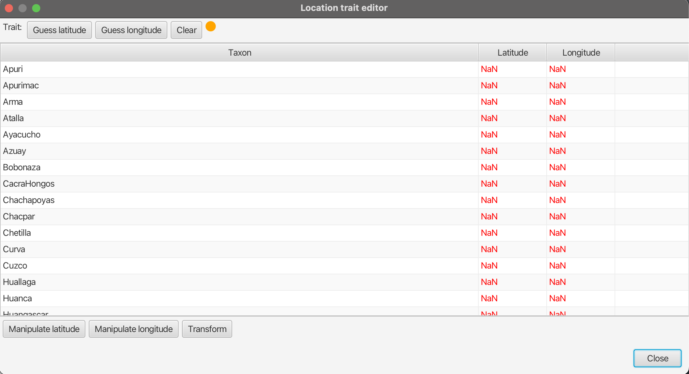
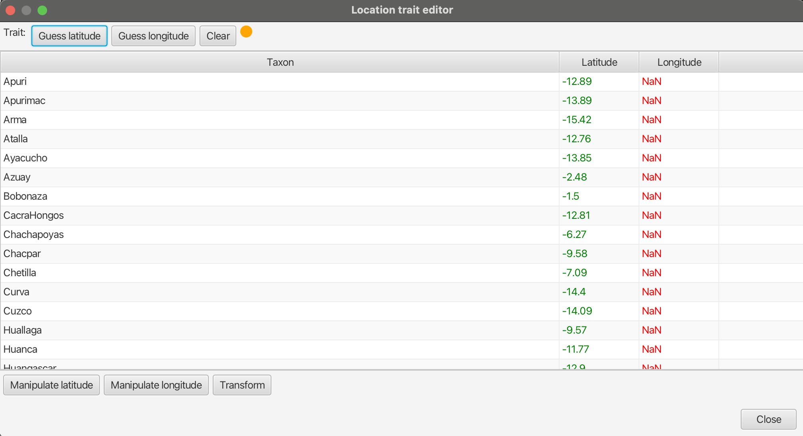
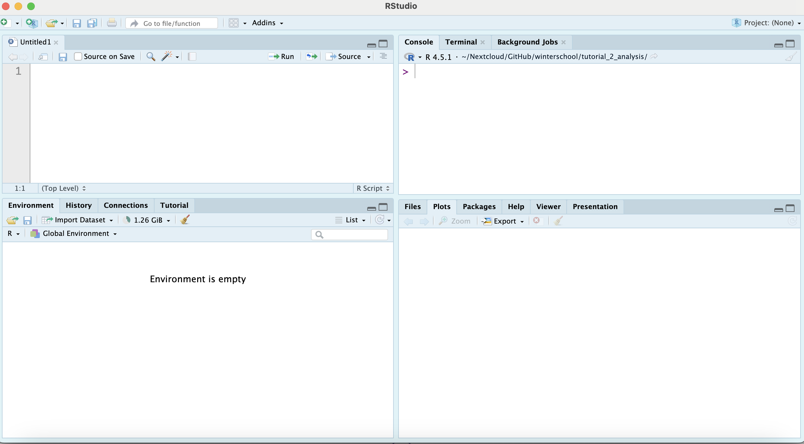

---

# Bayesian Phylogeography with Beast2

*Author(s):* Benedict King  
*Last Updated:* [Date]

## Table of Contents
1. [Introduction](#introduction)  
2. [Installing packages](#installing-packages)  
3. [Data Preparation](#data-preparation)  
4. [Configuring the Bayesian Phylogenetic Analysis](#configuring-the-bayesian-phylogenetic-analysis)  
5. [Running the Analysis](#running-the-analysis)  
6. [Interpreting Results](#interpreting-results)  
7. [Common Pitfalls & Tips](#common-pitfalls--tips)  
8. [References & Further Reading](#references--further-reading)  

---

## Introduction
In this tutorial, we will continue our analysis of the Quechuan language family. We will add an additional variable into the data, which is the locations of the languages in Latitude and Longitude. The location is analysed for every node of the phylogeny. A key advantage of this analysis is that it is performed at the same time as the tree reconstruction. Any uncertainty in the tree reconstruction is therefore accounted for in the analysis.

---

## Installing packages
Install the **GEO_SPHERE** package. Refer to tutorial 1 for how to install packages.

---

## Load the location data
You should already have a working XML file from tutorial 1. Load this into BEAUti (File > load). We only need to add the geographical analysis to the existing analysis.

To load the location data, click on File > Add Spherical Geography. Change the Trait name to "location" or something similar. You will now see a dialog box looking like this



In this dialog box we can enter the values for the locations of each language. You can do this manually, but to save time we will load the latitude and longitude from files ("Latitude.dat" and "Longitude.dat").
* click on *Guess latitude*
* select *read from file* and *Browse*
* Open the file *Latitude.dat*

You should now see that the Latitude column has been populated with values.


Repeat the process for Longitude.

---

## Running the analysis

The location data is analysed using a spherical diffusion model. For more details, see [the paper](https://peerj.com/articles/2406/). This is an update from diffusion models which analysed location as diffusion on a plane. The spherical diffusion model is much more accurate when the area under analysis is large. Analysis of location assuming diffusion on a plane is distorted by the projection used, for example the mercator projection. For smaller areas, the spherical diffusion model gives simlar results to diffusion on a plane.


The main parameter for the spherical diffusion model is *precision*. This determines how much diffusion away from the parent location is possible. Larger precision means stronger concentration around the parent. This value can be changed in BEAUti in the substitution model tab. Click on location under partitions and click the small button to the right of Subst Model. For now we will keep the value at the default of 100.

In the MCMC tab set the length of the analysis to 5 Million, Then save the file and run it in beast as for tutorial 1.


## Checking the analysis in Tracer

I will levae it up to you to check the analysis in Tracer and determine if it has run long enough. You might find that this analysis takes longer to settle than for tutorial 1, and you might need a longer burn-in than the default value of 10%.

# Displaying the results of the analysis

The output of the beast analysis is a log file of the parameter estimates and a tree file. The tree file is an *annotated nexus file*. It not only saves the tree, but includes node annotations. One of these annotations is the location. Each tree in the sample has a reconstructed location for every node in the tree. In other words, each tree in the sample represents an estimate of both the phylogenetic relationships of the languages but also their migration history. That's a lot of information! We need to summarise this information in a good way.

## remove burn-in using logCombiner
As a first step, remove the burn-in from the tree file. This makes the post-processing of results a bit easier, because we won't have to worry about mistakenly using trees from the burn-in later when plotting. Open the program **logCombiner**, which comes in the same set of programs as beast2, BEAUti and treeAnnotator. 

* Under file type, select tree files
* Add the tree log file from the analysis you just ran. Either drag and drop it into logCombiner, or click on the + symbol at the bottom left. 
* It is important to select the right amount of burn-in. As a default, 10% is shown. This might not be enough. You should have already seen in Tracer how much burn-in you need, so please adjust the value depending on your results
* Click **Choose file** next to **output file** and choose a suitable name for the new tree file (e.g. quechua_postburnin.trees)
* Click OK and a new tree file will be written, without the burn-in. Make sure you use this file for the rest of the tutorial

## Setting up RStudio

It is very common to use R code to process the results of a Bayesian phylogenetic analysis. Open up Rstudio.
Make a new script file by clicking File > New File > R Script. Save this script with a sensible filename and and in a sensible location (probably the same folder with the results of the beast2 analysis).

The Rstudio window is divided into 4 sections.



At the top left is the **script file**. We will gradually fill this with code during the tutorial. At the bottom left is the **environment**. This is a list of all the object in memory, which will start appearing as we start to run R code to make tables, lists and plots. At the top right is the **console**. This is where the R code gets executed. You can also type code directly into the console. The bottom right is where plots that we make are displayed.

Let's first install the packages we need. Cooy and paste the following code into the console.

```r
# Install packages
install.packages(# install.packages(c("ggplot2","rnaturalearth","rnaturalearthdata", "BiocManager", "ape", "ggrepel")))
BiocManager::install("treeio")

```

Before we continue, it's vital that we set the **working directory** in R Studio. It is usually sensible to set it to the same directory (folder) where your R script is. Click on Session > Set working Directory > To Source File Location. When we load files from the computer, we need to specify the PATH, i.e. where the file is relative to the working directory. This might not be the same for everyone, depending on where you have saved the workshop files and the R script.

The next step is to load the packages. You can add the following code to the script file. The last of these is a file from the workshop files (functions.R). Make sure you specify the correct path to this file form the working directory.

```r
# Load packages
library(ape)
library(treeio)
library(rnaturalearth)
library(ggrepel)
library(tidyverse)
source("functions.R")

```

# Plotting the trees on the map

The first step is to read the tree file including the node annotations into R. We also load the language locations.

```r
# read the trees, the postburnin trees you made with logcombiner
t <- read.beast("quechua_postburnin.trees")

# read the latitude and longitude files
lat <- read_tsv("../Latitude.dat")
lon <- read_tsv("../Longitude.dat")
# combine into a table
lang_locs <- full_join(lon,lat)
# filter so that only the languages included in the tree are used
lang_locs <- lang_locs[lang_locs$ID %in% t[[1]]@phylo$tip.label,]

```

The object *t* is a list of all the trees in the postburnin sample. These can be accessed individually e.g. ```t[[1]]``` accesses the first tree, ```t[[2000]]``` accesses the 2000th etc.
There is a function *tree_on_map* in the functions.R file which was just loaded. This plots the tree on the map, to visualise the spread of languages in space.

```r
# plot the first tree
tree_on_map(t[[1]], lang_locs)

```


